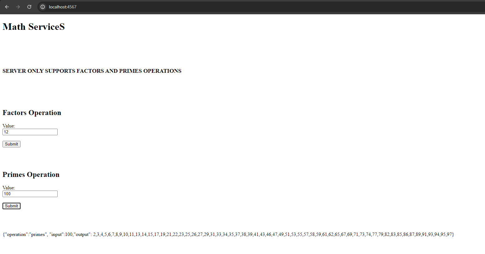
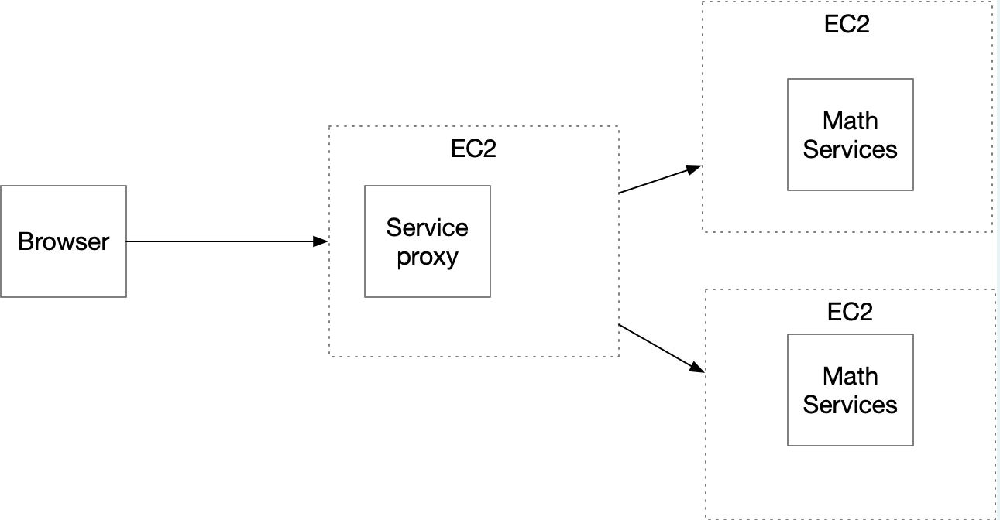

# AREP-PARCIAL2

## REQUISITOS
* [Java version 17](https://www.oracle.com/co/java/technologies/downloads/) - Lenguaje de programación usado.
* [Maven](https://maven.apache.org/download.cgi) - Gestor de dependencias del proyecto
* [Git](https://git-scm.com/downloads) - Gestion de versiones del proyecto

## DESCARGA Y EJECUCION

Primero, se tiene que clonar el repositorio, use el siguiente comando:

```bash
git clone https://github.com/santiforero1018/AREP-PARCIAL2
```

luego de eso, muevase a la carpeta del repositorio, ya sea por medio del explorador de archivos y abrir una terminal desde alli o usando comandos del sistema operativo para llegar al destino. una vez ahi, compile el proyecto con el siguiente comando:

```bash
mvn clean install
```

y para ejcutar el proyecto, puede hacerlo desde su IDE de preferencia para usar las opciones de ejecución, recuerde que debe ejecutar las siguientes clases:

```
Proxy.java ubicada en la carpeta de proxyServer
MathServer.java ubicada en la carpeta MathServiceServer
```

o parandose en la carpeta raiz del repositorio, puede ejecutar los siguientes comandos

- Para linux
  ```bash
  java -cp "target/classes:target/dependency/*" edu.eci.arep.parcial2.proxyServer.Proxy
  java -cp "target/classes:target/dependency/*" edu.eci.arep.parcial2.MathServiceServer.MathServer
  
  ```
- Para Windows
  ```bash
  java -cp "target/classes;target/dependency/*" edu.eci.arep.parcial2.proxyServer.Proxy
  java -cp "target/classes;target/dependency/*" edu.eci.arep.parcial2.MathServiceServer.MathServe
  ```


cuando ya se tenga corriendo la aplicacion, se proda ver el siguiente formulario


## PRUEBAS
aqui se adjutan agunas pruebas en la maquina local

- Factores
  
- Primos
  

## DESPLIEGUE EN AWS

A contuniación se presenta un video del trabajo en el despligue de AWS cumpliendo con la arquitectura correspondiente



## AUTOR
- Santiago Forero Yate - [mi perfil de github](https://github.com/santiforero1018)
